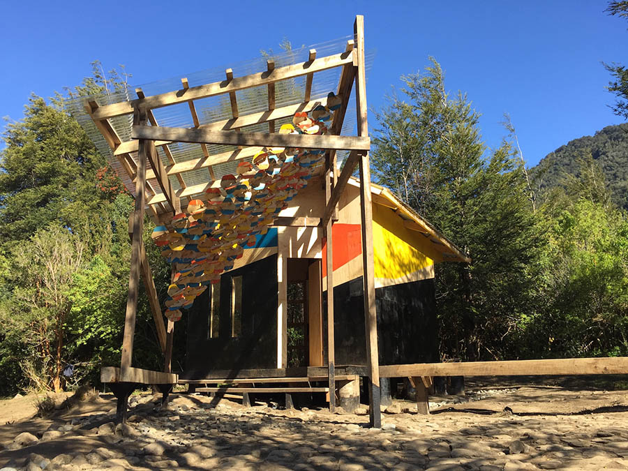

## Bitácora de la Travesía Vodudahue 2015

Travesía realizada a la localidad de Vodudahue, Fiordo Comau, Región de los Lagos, Chile; entre el 18 de Octubre al 2 de Noviembre de 2015.

Participan los talleres de primer año de diseño, ciclo superior de diseño gráfico y alumnos de titulación de diseño gráfico e industrial.

**e[ad] Escuela de Arquitectura y Diseño, Pontificia Universidad Católica de Valparaíso**