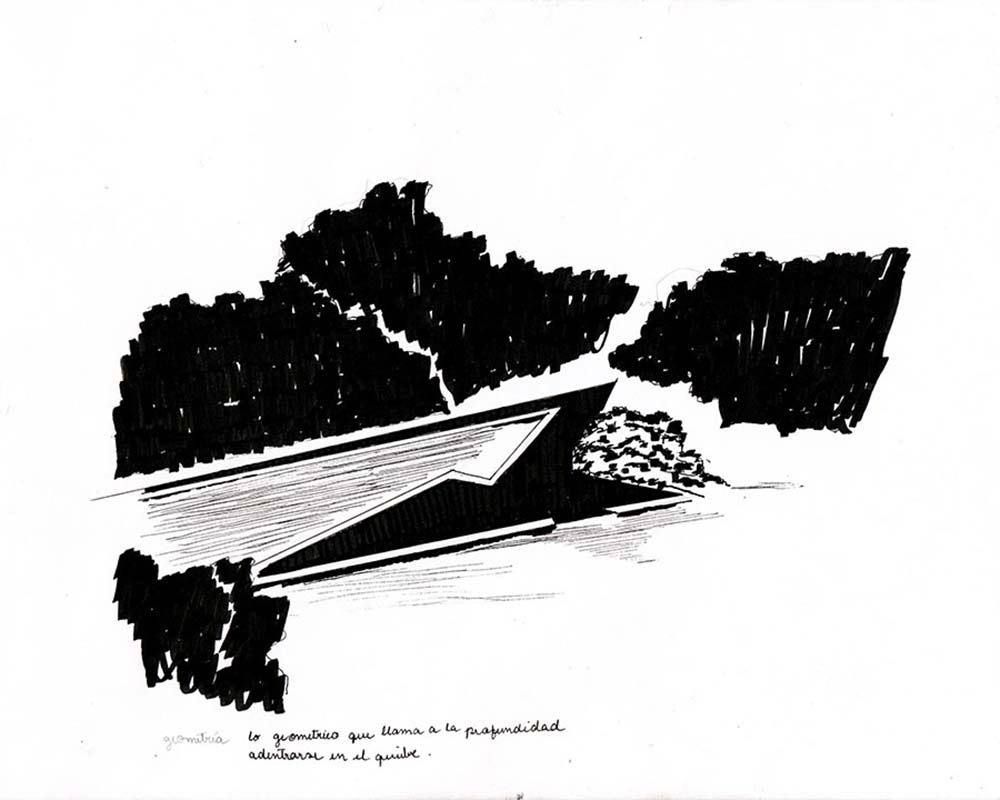

# Daniela Gajardo

### Primera jornada: Croquis y observación en terreno

####Hospedería de la entrada

*Construcción de una trama diagonal que permite entrever. El cruce entre diagonales y elementos verticales. Confluir de los elementos para formar un conjunto que funciona como unidad en donde existe un delante y un detrás, aquello que puede ser visto a través de esta trama construida.*

#### Arpa eólica

*Existen diagonales que poseen un sentido, desde la repetición hacia el sentido del conjunto. 
Aparece cierta transparencia, aquello que se deja ver a través de los ejes diagonales.*

####Pilares de Hormigón

*La curva aparece en contraste con los ejes verticales. Existe una repetición del horizonte. El cruce de lo vertical y lo horizontal*.

###Hospedería Rosa de los vientos

*La mezcla entre la vegetación y la obra hacen que esta se encuentre inscrita dentro de un contexto mayor. Aparece este resplandor de la obra aportado desde el color blanco que brilla desde este contexto. La obra emerge y se destaca desde la lejanía.*

*El contraste entre las curvas y las líneas diagonales. La aparición de esta mezcla de elementos diferentes en una misma obra en armonía dentro de un espacio acotado.*

####Hospedería Colgante

*Repetición de caras curvas en un plano. La curva repetida aporta profundidad a la extensión de la obra*

####Palacio del Alba y el Ocaso

*Perfil que se va modelando. La aparición de diversas caras, en donde el contraste hace aparecer el distingo entre una cosa y otra, los límites de la obra. *

####Faubourg

*Escala de grises perfilada por la luz. Aparición de un horizonte geométrico.*

*La diferencia de perspectivas ascienden hasta la creación de un horizonte perfilado, que combina las diferentes alturas, como niveles que no poseen un orden ascendente sino que se muestran de manera aleatoria.*

####Hospedería del Errante

*Manto modulado ascendente, el cual cubre el espacio en esta modulación que asciende. En la aparición de las ventanas se produce el juego entre las líneas rectas y las diagonales*

####Megaterio

*El perfil que nace desde las alturas. Un horizonte construido intervenido por las verticales de hormigón*

####Pozo Escultórico

*La geometría llama a una profundidad, adentrarse en el quiebre, encontrarse con aquello que se aparece dentro de la profundidad.*

### Segunda Jornada: estudio y recopilación

####Hospedería de la entrada

*La trama del techo se reune con aquella que se erige desde el suelo. Los elementos se reunen en las diagonales, en donde la obra adquiere un sentido y una dirección a partir de las líneas rectas.*

####Arpa Eólica

*El proceso consiste en traspasar el croquis  desde trazos dibujados y tramas a  un dibujo en alto contraste para mostrar los perfiles y rasgos característicos de la obra, en donde predomina su orientación diagonal.
El dibujo persiste en hacer aparecer la orientación, aquella dirección a la que apunta la obra*

####Pilares de Hormigón

####Hospedería Colgante

####Palacio del Alba y el Ocaso

*El dibujo en blanco y negro, el alto contraste muestra un primer acercamiento a una abstracción, es la búsqueda de los límites que tiene aquello que estamos mirando. Desde que dibujamos establecemos una relación lineal entre lo que estamos mirando y el soporte del dibujo.
Existe un traslape de las formas, aquello que se encuentra más adelante de aquello más lejano. 
Grosores, alturas, la geometría desde la verticalidad. Contornos, líneas y figuras*.

####Faubourg

####Hospedería del Errante

####Megaterio

####Pozo Escultórico

## Tercera jornada: Producción (originales)

Se trabaja en los íconos para la exposición (35x35 cms)

####Hospedería de la entrada

*Doble perfil que crea una trama, el juego que se crea en el cruce. Entrever a partir de esta trama constructiva que posee cierta transparencia. Se compone de varios elementos que se reunen en estas diagonales, una trama inclinada que se repite varias veces.*

**Geometría:** *Para trazar el dibujo se utilizan los ejes verticales y diagonales, en una sucesión aparecen hasta cierto punto se muestra la repetición y el entrecruce de diagonales.
*

####Arpa Eólica

*Diagonales en repetición, esta obra posee la particularidad de erigirse de manera diagonal creando un perfil de sombra que se relaciona con los demás al poseer la misma dirección.*

**Geometría:** *El trazado se manifiesta vertical y diagonla presentando la dirección de la obra y su carácter de repetición.*

####Pilares de hormigón

*Aparición y convivencia entre el horizonte lineal y el perfil curvo.Sucesión de perfiles, el cruce de la horizontalidad y verticalidad de la obra.*

**Geometría:** *El trazo posee distingo en los grosores, con diferentes alturas. Aparecen diagonales que insinuan parte e la forma. La figura horizontal es intersectada por estos ejes. Existe una transparencia, la tensión se marca en el punto de encuentro entre ambas.*

####Hospedería de la rosa de los vientos

**Geometría:** *Las diagonales conviven con lo curvo. Existe una relación de diferencia de dirección en las ventanas, existen quiebres y horizontes dibujados.*

####Hospedería Colgante

*Interacción de curvas, la sucesión de caras. Existe un blanco que prevalece y resalta dentro de un contexto. Desde la altura aparece en contraste entre lo curvo y lo recto.*

**Geometría:** *El dibujo de la curva se traza levemente respecto de la rectitud*

####Palacio del Alba y el Ocaso

*Superposición de caras, existe un delante y un detrás. La línea asciende y desciende en la construcción de este perfil que se va modulando. El traslape de las formas.*

**Geometría:** *La línea que compone el icono intercala grosores y alturas. Se trazan las líneas de manera geométrica dentro de los ejes verticales que varían su altura.Aparecen diferencias en el grosor del trazo, lo que tre a presencia un juego de alto contraste. 
Qué es lo uno y lo otro, la abstracción aparece desde el contorno de una forma, hasta la manera de hacer presente el distingo de una cosa y otra.*

####Faubourg

*Perfiles verticales, existe un conjunto de grises superpuestos, geometría. El ascenso de los perfiles verticales, gradación de tamaños, se crea un nuevo horizonte desde la geometría de la construcción.*

**Geometría:** *La construcción se basa en intercalar lineas verticales en diferentes alturas, mediante los diferentes grosores de línea es posible traer a presencia la profundidad que posee la obra, estos distintos perfiles que se reúnen en un mismo plano y crean una figura que se compone de fragmentos, es decir, unidades discretas que conforman una relación entre el todo y las partes.*

####Hospedería del Errante

*Manto modulado en diagonales. El ascenso de la línea en una modulación, cambia su sentido mediante los quiebres, se forma un contorno quebrado que posee su propio ritmo en el ascenso.
*

**Geometría:** *La construcción se realiza desde diagonales que se comportan de manera independiente una de la otra. Cada una posee su propia dirección y se muestran de manera independiente.
La repetición de la geometría de las ventanas hace aparecer una sucesion de elementos que hacen un ritmo y establecen un orden respecto al contraste que se mantiene por las diagonales que forman el contorno de la obra. El trazo varía respecto de la inclinación que posee la línea.*

####Megaterio

*Horizonte desde la altura, la aparición de un perfil continuoconstituido por un modulo que se repite. Se dibuja desde la altura, horizonte con leves intervenciones de lo vertical.*

**Geometría:** *Es importante hacer aparecer ese rasgo que se repite, la intersección vertical en el horizonte que se dibuja. Ejes que se entrelazan.*

####Pozo escultórico

*El espacio geométrico, la forma geometrica hacia una profundidad, adentrarse en el quiebre.El rasgo aparece desde el quiebre.*

###Quinta jornada: iconos digitales

####Hospedería de la Entrada

*Para la construcción de este icono se utilizó la base del original hecho a mano, realizandole cambios 

#### Arpa Eólica

#### Pilares de Hormigón 

#### Hospedería de la Rosa de los Vientos

#### Hospederia Colgante

#### Palacio del Alba y el Ocaso

#### Faubourg 

#### Hospedería del Errante

#### Megaterio

#### Pozo Escultórico

