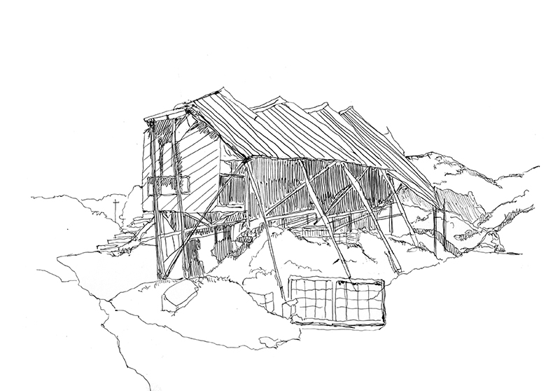
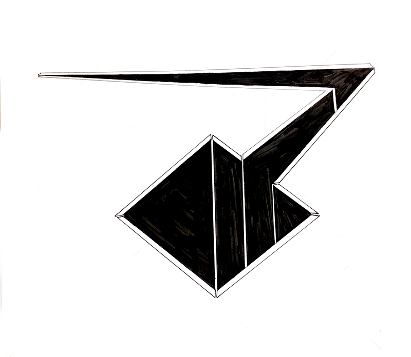

# Valentina Olivares

## Primera jornada: Croquis y observación en terreno
### Parte baja
#### Hospedería de la entrada

La obra se presenta a través de su emplazamiento y volumen dando la bienvenida a los huéspedes de ciudad abierta. La suspensión de la obra entrega otra dimensión desde la cual puede ser contemplada, la obra presenta dos horizontes 

La distorsión de la trama hace aparecer la forma sobre el volumen

#### Arpa eólica

Las diagonales que componen el conjunto conforman el contorno de la figura y se ordenan los elementos que componen la obra. La forma en que la diagonal se presenta genera un perfil de sombras que pertenecen a la forma, dejándola expuesta frente a nosotros.

#### Pilares de Hormigón

Aparece en su materialidad que contrasta con el espacio de la duna y vegetación, además de las rectas y las curvaturas que lo sobreponen horizontalmente.

#### Mesa del entreacto

Suelo construido para el descanso,  compuesto de horizontales y diagonales que se interrumpen por un cielo de estructuras de madera.

#### Hospedería Colgante

Su emplazamiento en la duna le otorga un contraste entre el espacio y su materialidad, aparecen los paneles curvos que la caracterizan y la hacen presente en las arenas.

#### Palacio del Alba y el Ocaso

Se presenta la materialidad como ladrillo y la curva de la estructura que otorga luminosidad y contraste al conjunto de figuras que aparecen en el horizonte.

#### Hospedería del Errante

Aparece a través del trabajo en su forma, las distinciones entre recta y curvas generan el perfil de la hospedería, además de las interrupciones luminosas como ventanas y celosías.

#### Megaterio

Aparece en su materialidad de hormigón y cómo se emplaza en el espacio, la perspectiva que entregan sus verticales y cómo estas interactúan con la luz, generando perfiles de sombras.

####Anfiteatro

Espacio destinado para la contemplación, su extensión se hace presente a través de su materialidad de ladrillo, que entrega rectas naturales que se complementan con las construidas en la obra.

####Pozo Escultórico

Recorrido geométrico que llama a la interrupción y a la profundidad de la sombra, centrándose en el quiebre de la luz.

### Segunda Jornada: estudio y recopilación
### Parte baja

####Hospedería de la entrada

Se visualizan los perfiles de la obra,buscando la simplificación de los detalles que prenan, en este caso se opta por las diagonales del techo, su continuidad en la parte superior comprenden la mayoría del espacio, dandole un ritmo a la obra.

#### Arpa eólica

La observación de las partes como un todo, simplificando los contornos y dando una imagen compuesta de lo que es la obra.
En este caso es la sombra la que define el contorno, entregando un trazo continuo de las verticales.

####Pilares de Hormigón

Estudio de las formas que componen la obra, buscando esquematizar las curvas y verticales que caracterizan el corpus de la escultura.

Se utiliza la luz como separador de las formas, ya que al enfrentarse a esta se trae a presencia los elementos que componen la obra.

####Hospedería Colgante

Se esquematiza la obra, dando a ver las curvas que la caracterizan y cómo los bordes se hacen ver al contrastar con el blanco de la materialidad.

### Parte alta
####Palacio del Alba y el Ocaso

Se observa el palacio por unidades y cómo estas se presentan en magnitud al enfrentarse, también el efecto de la luz y cómo las sombras se presentan en la superficie.

####Hospedería del Errante

La hospedería como magnitud presenta variados elementos y secciones de la obra que tienen elementos característicos entre sí, la geometría de los planos y el efecto de la luz en la superficie denotan las particularidades de la obra.

####Megaterio

Se observa y esquematiza cómo la luz denota sus partes en su materialidad,
las sombras separan la parte superior de la inferior y pilares.

####Anfiteatro

Se observa como totalidad y cómo se presenta en el espacio, las rectas y diagonales que delimitan el área entre el espacio para quién observa y el que presenta, existe una distinción entre la planicie del escenario y la geometría de las "bancas".

####Pozo Escultórico

Se observa cómo la luz se hace presente y diferencia las diferentes partes del recorrido, tanto el inicio como la profundidad del fondo.

## Tercera jornada: Producción (originales)
Se trabaja en los íconos para la exposición (35x35 cms)

### Parte baja

####Hospedería de la entrada

Se rescata la parte superior de la hospedería, usando la sombra como superficie
la luz se presenta a través de los trazos y la geometría del techo.

#### Arpa eólica

Se utiliza la sombra como superficie para las unidades del arpa, la sombra expone la magnitud de las verticales y su forma.

####Pilares de Hormigón

La sombra dibuja el volumen del cuerpo, mientras que la intervención de luz en los contornos diferencia las formas.

####Hospedería Colgante

Se replica la imagen que la obra entrega, sus superficie blanca delimitada por sombras, pero simplificadas.

### Parte alta

####Palacio del Alba y el Ocaso

Se utiliza la forma de las estructuras y la repetición de estas para
esquematizar una pequeña parte de la dimensión de la obra.
La luz interviene las formas y da paso a un trazado que deja ver y diferenciar las superficies entre ellas.

####Hospedería del Errante

Se muestra el cuerpo central de la obra, que contiene rectas e intervenciones de luz, delimitando el contorno de la figura, esta vez se dibuja sobre el blanco.

####Megaterio

Se ejercita la figura, teniendo una imagen de las lineas que lo componen,
junto con la forma en que la luz interactúa con estas.

####Anfiteatro

Se trata como una superficie vista desde un punto alto, que relata la mayoría de la obra en su perímetro. La luz dibuja los trazados entre las bancas y el escenario.

####Pozo Escultórico

Se dibuja el recorrido de la obra, diferenciando entre los trazos interiores y exteriores, la luz nuevamente se hace presente y delimita los bordes.

## Cuarta jornada: Corrección y rediseño

### Parte baja

Una de las desiciones al rediseñar es el eliminar la curvas y destacar los elementos a través de sus ángulos y rectas, la luz es utilizada como elemento fundamental que delimita los contornos entre las diferentes supericies de las obras.

####Hospedería de la entrada 

Se simplifica la forma y los trazos, destacando la geometría de la superficie del techo. La luz delimita los espacios y contornos. Existe una mirada desde arriba.

#### Arpa eólica

Se simplifica la forma, dejando solo las verticales del arpa, el efecto de la luz en la superficie deja contemplar la figura a traves de su sombra como una magnitud.
Se toma la extensión de las verticales como la forma predominante de la obra y cómo la luz actúa sobre estas.

#### Pilares de Hormigón

Se omite la parte superior que contenía curvas, dejando los pilares como una forma literal, sin embargo está la intervención de la luz entre las verticales y horizontales de la obra.

#### Hospedería Colgante

Se abstrae la forma curva de la obra en un espacio mucho más plano, la intervención de la luz como separador de los planos es mínimo pero aún así se hace presente.

### Parte alta
#### Palacio del Alba y el Ocaso

Se muestran las unidades del palacio como rectas, la luz trabaja las superficies y perspectivas de la obra.

#### Hospedería del Errante

Se simplifica la forma, el fondo se oscurece para que la luz pueda dibujar las superficies.

#### Megaterio

Se utiliza la sombra como recurso de fondo para que la luz logre trazar las rectas que componen y caracterizan la figura. 

#### Anfiteatro

Se corrige el espesor de los trazos, las superficies tienden a ser irregulares, pero la luz es continua.

####  Pozo Escultórico

Se corrigen los trazos, dejando las sombras como superficie para que la luz
pueda dar una imagen de la forma.
