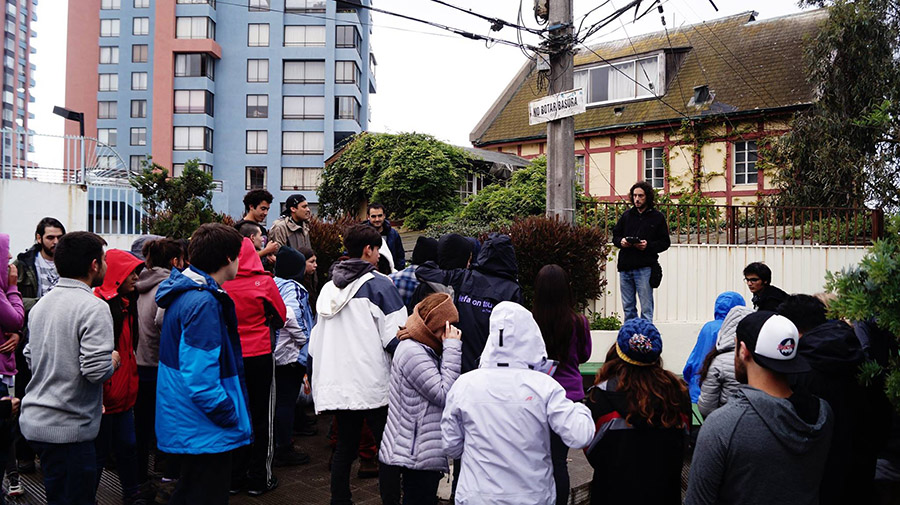

# Lunes 19 de Octubre

## Faenas

### Primera jornada

El encuentro de ambos talleres fue fijado a las 13:00 horas para cargar todo el equipamiento que se llevó desde Viña del Mar. Por su parte los alumnos pertenecientes al grupo de restauro tuvieron reunión a las 12:00 horas, con el objetivo de poder empacar la comida que faltaba y organizar los snacks correspondientes al primer día de viaje.

La salida es programada a las 15:30 horas. Desde ese momento los talleres de diseño plan común, tercer año de diseño gráfico y los titulantes invitados pasan a ser un sólo taller mostrando que la travesía ya no es de unos y otros.

El viaje comienza con la partida de los dos buses, uno para hombres y el otro para mujeres. El primer alcance de la ruta fue fijado hasta Puerto Montt, en el cual existieron dos paradas previas, siendo la primera en Talca, otorgando la oportunidad de pasar al baño y comer, incluyendo a los choferes, y la segunda fue para carga combustible al bus que es usado por los hombres.

### Segunda jornada

En la primera parada, el grupo de restauro entrega el snack personal correspondiente al horario. 
Durante la noche mientras la gran mayoría duerme, los buses paran en algunas ocasiones a recargar combustible.

## Restauro

Snack: Entrega de maní con pasas y  galletas frac + una botella de agua mineral. (Bus)
Cena: Sándwich de hamburguesa + Bebida. (Bus)

## Ámbito

Acto primero

La partida

Jaime Reyes @Plaza J.J. Latorre

Cuando está todo listo para partir Jaime nos invita a reunirnos antes de subir a los buses. Se sube arriba de una banca situada en la plaza y se dirige a nosotros, como taller, como un todo. 

Jaime Reyes:
“En la travesía uno deja de ser quien es y se transforma en una parte de un total, el cual es muy importante en cada parte de la cooperación de cada uno, es cuidarse y ayudarse, como una manada.”

