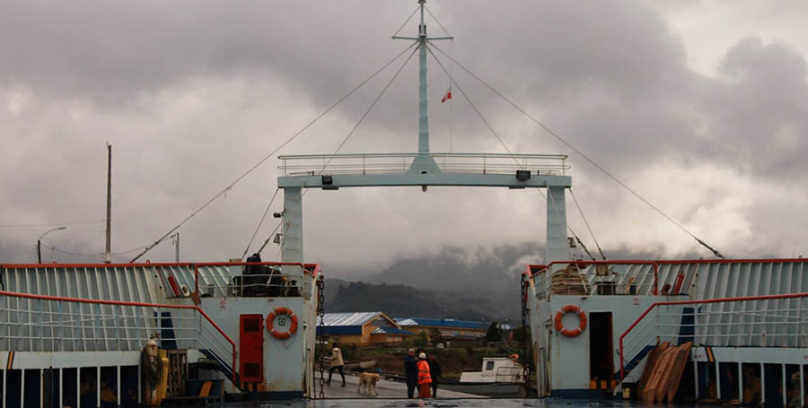
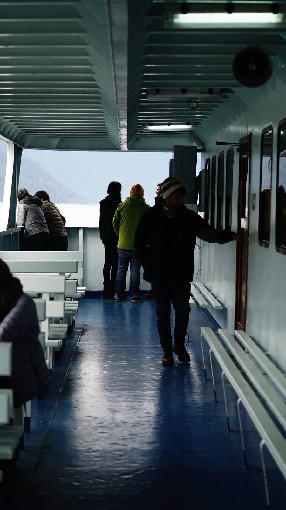
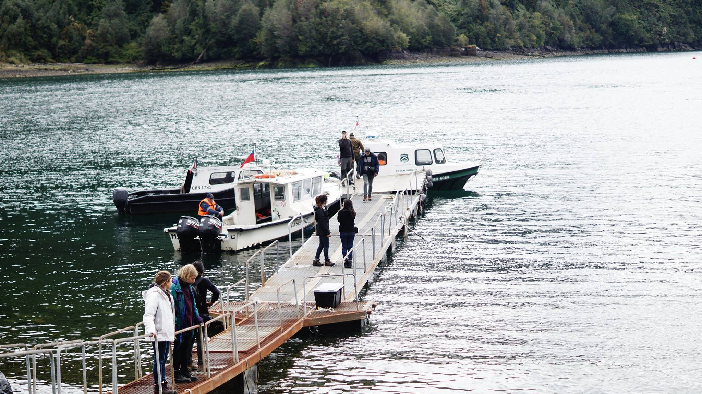

# Martes 20 de Octubre

##Faenas

### Primera jornada
Amanece junto con el arribo a Caleta la Arena donde nos encontramos con el grupo de avanzada. esta primera parada es utilizada para poder ir al baño. Tras abordar el transbordador con destino a Puelche seguido del viaje que dura aproximadamente 40 minutos y el regreso nuevamente al continente, se sirve el desayuno. 

El siguiente destino es Hornopirén, lugar donde nos embarcamos en el ferry "Naviera Austral"  a las 12:00 horas con destino a Leptepu.

### Segunda jornada 

Una vez arriba del ferry se prepara el almuerzo que consiste en un sandwich de atún, acompañado de un jugo y fruta en conserva. Posterior a esto se realiza la primera reunión, donde se da el primer encargo que busca vincular el trazo o pulso caligráfico con el del dibujo.

El trayecto en ferry duró aproximadamente tres horas. A las 15:00 hrs llegamos a Leptepu donde se descargó de forma inmediata todo el equipaje que se venía dentro del bus de mujeres para luego descargar el otro bus de hombres. Después se comenzó a cargar en las lanchas que nos llevan a Vodudahue, los implementos de cocina más todas las cosas que se descargaron de los buses. Se realizaron un total de 13 viajes, siendo el ultimo a las 20:00 hrs.

Mientras las personas en Leptepu cargaban las lanchas, los que estaban en Vodudahue, comienzan a levantar el campamento, ubicando y armando las carpas, además de el trasladando de herramientas, materiales y mochilas. Un grupo hace el hoyo para el uso de un primer baño mientras que otro prepara la cena. Se come a la intemperie ya que aún no esta armada la carpa comedor.

### Lanchas y cantidad de viajes.

- **Reina luisa: **3 viajes
- **Carabineros:** 4 viajes
- **Azul:** 2 viajes
- **Acuario (blanca con celeste)**: 2 viaje
- **Serenade:** 1 viaje
- último viaje, última lancha en llegar: 2 viajes

## Restauro

- Desayuno: Galleton de avena y pan de molde con jamón y/o queso + Caja de leche individual (Bus)
- Snack: Galletas toddy + Jugo individual (Bus)
- Almuerzo: Sándwich + fruta en conserva individual + manzana + jugo individual (Ferry)
- Snack: Super ocho + Leche individual (Leptepu)
- Cena: Tallarines con salsa bolognesa + Lechuga + Platano con manjar (Vodudahue)

## Ámbito

Encargo general, Mudar lo adverso en lo favorable

Jaime Reyes, Herbert Spencer @Ferry Hornopirén-Leptepu

Nos embarcamos en un viaje de aproximadamente 4 horas hacia Leptepu, vamos por mar, rodeados de montañas y árboles, el día estaba nublado lo que nos dió una vista sensacional de la lucha entre las nubes y los cerros. En esa instancia nos reunimos con nuestras bitácoras en la parte más alta del ferry. Jaime y Herbert nos aconsejan sobre el cuidado del cuerpo y el pulso que debemos llevar en el registro de lo que vemos.

Jaime Reyes

> Hubo un hombre que vivía en estos territorios, en el mismo fiordo, desde hace más de 25 años que se vienen realizando travesías hacia estos lugares fríos. Todas estas son aventuras en las que se ha conocido gente maravillosa, y se han superado momentos difíciles. Es una salida a lo desconocido.
Como por ejemplo un hombre que construía barcos y veía sus partes en los árboles de estos bosques impenetrables que crecen desde los pies de las montañas.
Tratar siempre de mudar lo adverso en favorable. Tenemos que estar dispuestos en cuerpo y espíritu.
La travesía logra mudar lo adverso en favorable, modo de ser que depende de cada uno. Mantener el cuerpo, la vigilia.

Herbert Spencer

> Nos encontramos fuera de lo habitual, fuera de nuestra "stasis" (en éxtasis), por eso todo es digno de ser registrado y anotado. Debemos llevar un pulso en la curiosidad, el estudio y en la reflexión. Nos encontramos navegando por este fiordo, ante una paisaje vastísimo, increíble. Las montañas nevadas, las nubes que borran sus cimas, el mar que recorta con su estrictez horizontal el manto verde. Estamos ante lo incontable de la naturaleza que se teje como un texto continuo. Y nosotros venimos con unidades discretas, ideales y geométricas. Así son los materiales que traemos (paraleógramos lineales, superficies, todos elementos geométricos ideales) Estos dos órdenes se van a encontrar en la obra. Y es el mismo encuentro que se da entre lo observado y el dibujo. Les propongo una ley para dibujar: que el trazo de la escritura y el dibujo sea el mismo, la caligrafía dice y dibuja a la vez. ¿Cuál es la relación de ese trazo con el total? ¿cómo se teje?

