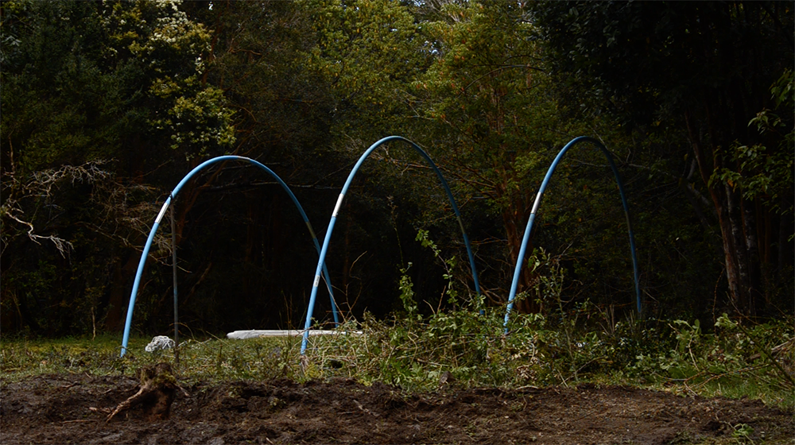
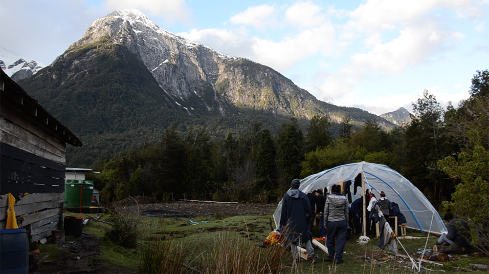
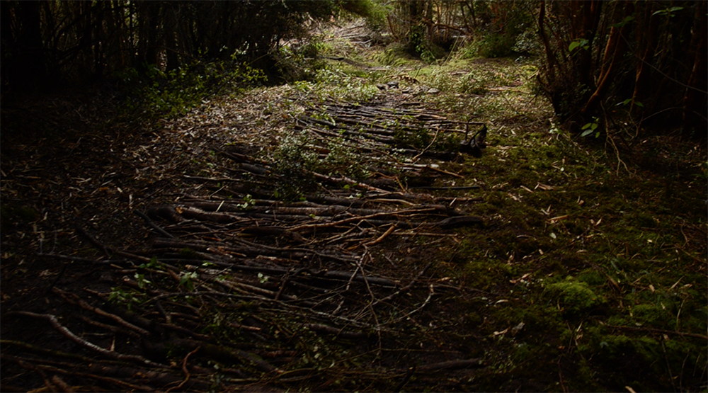

# Miércoles 21 de Octubre

##Faenas

### Primera jornada
El amanecer nos permite ver con una nueva perspectiva donde nos encontramos, nos acompaña una lluvia intensa que nos hace imaginar el mal tiempo que nos espera en los días posteriores tras este primer abrir de ojos se prosiguió  a tomar desayuno  por parte de aquellos que no pertenecían al grupo de restauro que se encontraban preparando este momento desde las seis treinta de la mañana, para poder servirlo a las ocho de la mañana hora acordada por el grupo de profesores durante la noche anterior.

Es tras esta instancia  que se dan las faenas a realizar durante la mañana todas estas en son de poder acomodar el campamento.

Se crean grupos de trabajos liderados por el equipo de equipamiento, se comienza a trabajar en la construcción de la carpa comedor, quedando en un primer momento levantada con sus accesos completamente abiertos, pero dándonos un lugar donde poder guarecernos de la lluvia que nos acompaña desde la noche anterior, tras esto se comienza a trabajar en la construcción de ocho mesas construidas a partir de puertas y listones pre cortados llevados desde la escuela. Paralelamente se construyen y designan  los lugares donde sera dejada la basura, esta separada en orgánica e inorgánica de igual manera se cambian algunas carpas personales montadas el dia anterior por efectos de la lluvia.

De igual manera un grupo de alumnos comienza a limpiar el terreno de la obra y a crear un camino hacia ella esto acompañados por Don Oscar quien abre camino con su motosierra a través del bosque que separa el campamento del claro de la obra. Por otro lado la creación de un lugar donde poder plasmar ideas grupales es solucionando pintando una de las paredes de la casa (cocina) con pintura negra de pizarra.

El almuerzo es servido ahora protegidos de la lluvia con mesas pero aun sin poder sentarnos y es tras el comer que las faenas vuelven a comenzar ahora se construyen las bancas para el comedor. A sí mismo la lluvia comienza a descender permitiendo contemplar con otros ojos donde nos encontramos, es posible apreciar la majestad de las montañas nevadas que nos rodean ya sin nubes y que aparecen casi de la nada con esplendor.

### Segunda jornada 

La tarde continúa con las faenas de construcción del campamento y la importancia de crear un camino hacia la obra, este es realizado con troncos pequeños utilizados en los lugares donde el barro y los desniveles son un obstáculo. Mientras esto sucede las personas que ya durante la mañana arman la carpa comedor, construyen una segunda carpa en el lugar de la obra, está para ser utilizada para guardar las cosas de pañol que se van a utilizar en el lugar.

El día concluye con la cena está siendo la primera comida con todos sentados alrededor de una mesa cubiertos de la lluvia y en su mayoría del frío además se piden las bitácoras de todos para poder intervenir la portada y marcar el comienzo de la aventura que nos espera.

   	
##Restauro

- Desayuno: Té o café + Pan con manjar + Yogurt con avena
- Snack: Frutos secos + Manzana + Jugo
- Almuerzo: Carne al jugo con puré + ensalada a la chilena y macedonia
- Snack: Galletas selz + Barra de cereal + leche individual + manzana
- Cena: Chapsui de carne con arroz + Manzana con manjar. 

##Ámbito

Acto segundo, Intervención: Hasta el fondo de lo desconocido

@Carpa-comedor Titulante Ámber Oyarzún

Al término de la cena, se pidió a todos que dejaran sus bitácoras en la carpa porque serían intervenidas las tapas, como tratando de que todas en su singularidad, tuviesen algo en común de esta travesía.

