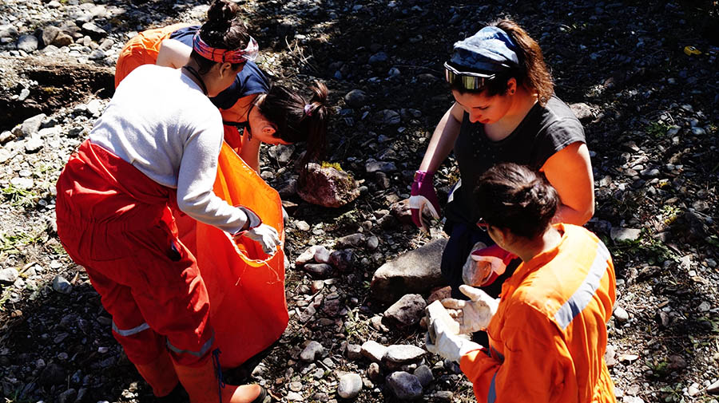
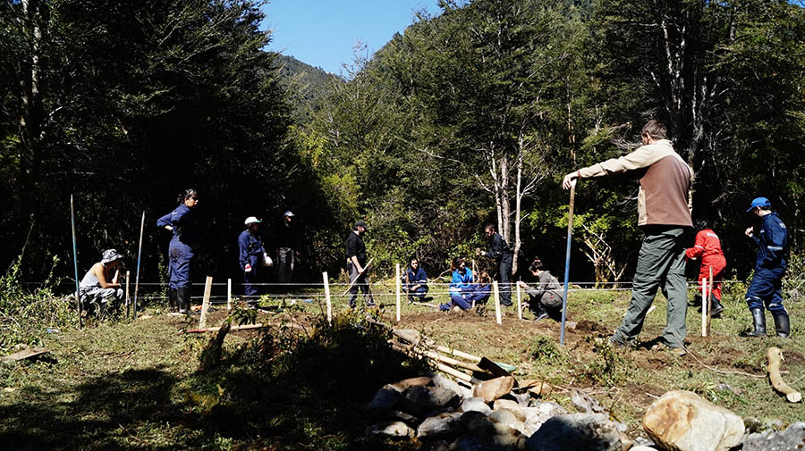

# Jueves 22 de Octubre

##Faenas

###Primera jornada

- Recolección de piedras: Un grupo va en busca de piedras chicas, medianas y grandes a la ribera del río, piedras que más tarde serán utilizadas de base para las fundaciones y para sostener de forma erguida las mismas.

- Corte y traslado de troncos ("tococos"): Don Oscar corta con motosierra una serie de troncos de aproximadamente 1,2 mts de largo y 40 cm de diametro. Estos quedarían en el camino que queda entre el campamento y la obra. Tres grupos compuestos por cuatro hombres se dedican a trasladar los troncos a la obra. Mediante un sistema de cuerdas que van desde el tronco a palos menores se levanta, por un lado, y se traslada, por otro, el tronco. Finalmente se trasladan 14 troncos que serverían como pilotes para las fundaciones de la obra.

- Trazado y nivelación del suelo de la obra: Con pitas y estacas se comienza a trazar la extensión de la planta de la obra. Estos mismos servirían posteriormente para ubicar las fundaciones y medir los niveles de cada una de ellas. Con esto último se puede comenzar también la tarea de registrar la medida que debe tener cada excavación para contener cada tronco y quedar a nivel.

- Carbonileado de troncos: Los troncos ya ubicados en los alrededores de la obra comienzan a ser carbonileados para sellarlos y protegerlos del exterior.

* Entre la jornada de la mañana y la jornada de la tarde se dá paso a un tiempo para el cuerpo y la preocupación del mismo, es así como se da un tiempo para que los estudiantes fuesen al río a bañarse.

### Segunda jornada

- Pintado de pajaras: El pintado de las pájaras fue realizado por un grupo de alumnas, donde algunas pintaban con pintura azul y otras con naranjo, utilizando pinceles, pequeños rodillos y brochas hechas de esponja. Lo que se pintaba era solo el trazado realizado por profesor Carlos Chávez, creado por la superposición de una pieza sobre otra. Una vez terminadas se colocan al sol sobre una superficie de madera. Esta faena se realizó bajo la sombra de un árbol del campamento, cerca de la carpa comedor, cuyo trabajo era supervisado por Jaime Reyes.
- Inventario de vigas: Un grupo de 4 estudiantes se dirigieron a la bodega en donde estaban las maderas que Don Oscar había puesto a disposición para la obra. Éstas serían separadas y agrupadas según sus dimensiones para poder tener un catastro de cuantas piezas habían de cada sección.
- Excavación y fundaciones: Teniendo claro el trazado, el nivel y las medidas de cada pilote, se comienza a excavar en el lugar donde irá cada cada uno de ellos, los cuales se distribuyen en una cuadricula de letras (a, b, c, d, e) y números (1, 2, 3, 4, 5). Con las excavaciones hechas se pasa a poner una primera capa de alrededor de 15 cm, de piedras las cuales serán la base solida en que se apoyaran los troncos, luego de eso se depositan los mismos en las excavaciones, se alinea con los otros y se rellena el resto de la excavación en torno al tronco con piedras y tierra, apizonándolo para que quede firme, erguido y sin movimiento. Dicha tarea nos llevó toda la tarde.
- Corte de excedente: Con motosierra los profesores Alfred y Herbert comienzan con el corte del excedente de los pilotes.
- Complicaciones: Algunas complicaciones retrasaron el trabajo en general, ésto producto de que algunos pilotes quedaron desplazados de los ejes, razones por las cuales tuvieron que ser removidos, reubicados y vueltos a fijar; y otros quedaron excesivamente bajo el nivel, razón por la cual se tuvo que volver a nivelar a la baja, en relación con el pilote más bajo. De esta forma finalizó el día con los pilotes puestos y fijos en sus lugares.

## Restauro

- Desayuno: Té o café + Pan con jamón y queso o mermelada + Leche en polvo o Yogurt.
- Colación: Galletón + Naranja + Jugo.
- Almuerzo: Charquicán + Lechuga + Durazno en conserva con crema.
- Colación: Frutos secos (maní con pasas) + leche individual + manzana.
- Cena: Tortilla de atún con papas doradas + Arroz con leche.

##Ámbito

Acto Tercero, Inicio de la obra

Carlos Chávez @Lugar de la obra

Nos fuimos todos al lugar donde se empezaría a construir la obra, hicimos una hilera trazando la diagonal de la cubícula que en los próximos días construiríamos, anticipándonos al eje que uniría la obra con la escultura.
A nuestros pies, las 60 y tantas bitácoras también en hilera, indicando el mismo eje. Carlos procede a leer un poema y da pasos cuidadosos, de un extremo a otro, mientras lee pausadamente, para no tropezar con el terreno que aún se encuentra lleno de recovecos.

Luego, cada uno busca su bitácora, que ahora en la portada tiene impreso un fragmento de la frase "Hasta el fondo de lo desconocido" en Frutiger.
Esta impresión estuvo a cargo de Mauro Villena, que preparó un juego de tipos móviles exclusivamente para la travesía.

Carlos Chávez: *Falta el poema que leyó*