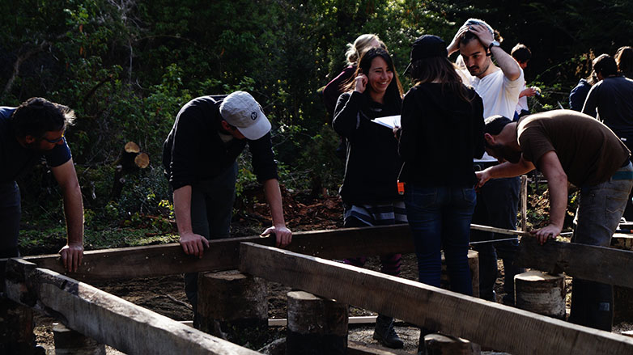
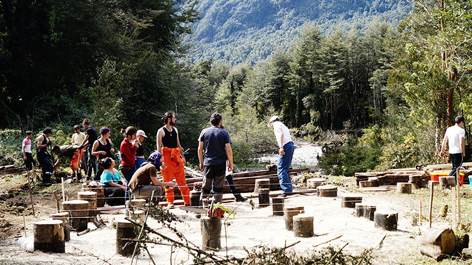
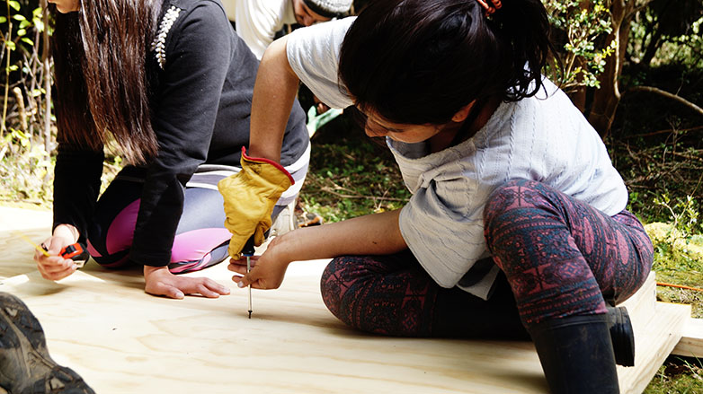
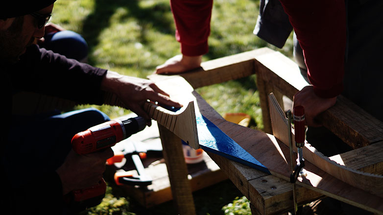
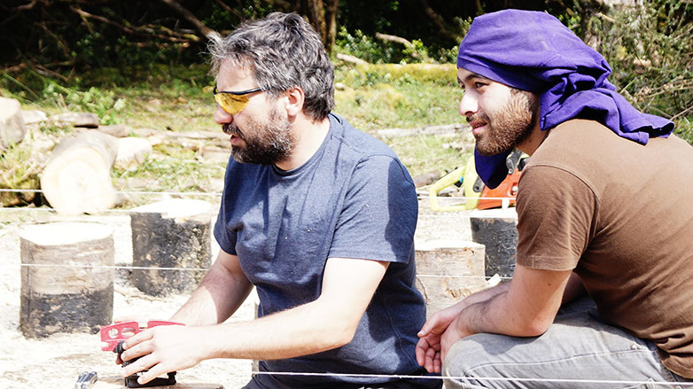

# Viernes 23 de Octubre

## Faenas

### Primera jornada

#### Cubícula
- Traslado de vigas: Un grupo de 4 estudiantes comienzan a trasladar 15 vigas de 3,6 m. x 2' x 6' desde la bodega a la obra, éstas serían utilizadas más tarde para ser apoyadas en los pilotes y sostener el suelo de la obra.
- Corte de excedente de pilotes: Los profesores Herbert y Alfred continuan con la faena emprendida el día anterior de cortar el excedente de los pilotes para que queden a nivel.

- Renivel de las fundaciones: Se verifica  el nivel real en que quedaron los pilotes, encontrando diferencias importantes entre ellos, razón por la cual se vuelven a marcar y a cortar. Posteriormente se vuelve a medir y se vuelven a encontrar diferencias, razones por las cuales se decide volver a hacer el trazado con la pita y las estacas armando una red de pita sobre los pilotes. 

- Sellado de planchas: Paralelo a lo anterior, se comenzó la faena de carbonilear y sellar las planchas que serían parte del suelo.

- Construcción de paneles: Junto con lo anterior, se comienza también a construir los paneles que serían las paredes de la cubícula.

#### Escultura: Extensión Americana

- **Armado**: Las pájaras pintadas en el día anterior comenzaron a ser ensambladas. Para armarlas, existían dos tipos de unidades diferentes: piezas sin semicortes y piezas con semicortes, las cuales se atornillaban a la pieza lisa. Se fijaba la pieza lisa a una superficie con ayuda de los sargentos o las prensas, se encolaba la parte curva y se pegaba una de las otras piezas (los semicortes le dan flexibilidad a la madera) con ayuda de un sargento. Se le hacía una perforación con el taladro y luego se atornillaba, esto se repetía en 5 puntos diferentes por cada lado de la pieza lisa, por ende, cada pájara correspondía a 3 piezas: una lisa y dos con semi cortes. 4 de estas pájaras terminaron con 4 piezas, ya que sobraban 4 piezas, las cuales se repartieron.

- **Preparación del lugar**: Luego de haber terminado las 12 pájaras, tocaba despejar y limpiar el espacio en donde la escultura tomaría lugar. Este sector se encontraba un poco más atrás de la cubícula, adentrándose al bosque. Aquí hubo que cortar algunas ramas y troncos para despejar el follaje, ya que la escultura iría montada en el aire, suspendida entre los árboles.

### Segunda jornada

#### Cubícula
- **Renivel**: Se trata de confirmar el nivel de la red pero esta vez con el nivel de laser, encontrando nuevas diferencias.

- **Presentación y selección de vigas**: Producto de las complicaciones anteriores es que se opta por ir seleccionando cada viga (dado que su ancho podía variar), éstas iban siendo presentadas en la ubicación en que podrían ir, cambiandolas de lugar dependiendo de en donde podrían tener más apoyo.

- **Fijación de las vigas**: Con un lado puesto y fijado se comienzan a fijar las vigas perpendiculares a ésta. Debido a que éstas no alcanzan a cubrir el largor de la obra se debe hacer una extensión de la misma a partir del ensamble con otra viga de un ancho similar, por lo tanto ahora había que hacer coincidir la unión con la viga perpendicular que cerraba la cuadrícula, de tal forma que había que seleccionar las vigas que siendo irregulares calzaran con esas dos dimensiones en una misma extensión determinada. Toda esta faena llevó bastante tiempo, teniendo que continuar más allá de la jornada de trabajo ordinaria e incluso más allá de la cena, hasta la noche. En ello se quedaron los tres profesores, los profesores ayudantes y un par de alumnos, quienes finalmente lograron terminar con el suelo, quedando sólo 1 viga a medio fijar, la cual sería rematada en la mañana del día siguiente.

#### Escultura: Extensión Americana

- **Montaje**: Se colgaron las primeras dos pájaras para ver cómo se comportaban en el aire. Para esto, cada pieza central de cada pájara poseía 4 orificios, 2 al centro y 2 a los extremos, de manera de atar los extremos a los árboles. Una soga pasaba por uno de estos extremos, se le hacía un nudo por ambos lados de la pieza para evitar que se deslizara y el resto de la soga se tiraba a una rama alta de un árbol de manera de hacer una polea. Luego esto se repetía con el otro extremo.

Durante esta jornada, se pensó bien como colgar las pájaras, ya que habría que bajar y subirlas a cada momento de colocar una nueva pájara y el peso cada vez sería mayor. La faena concluyó aquí para seguir con el montaje final al día siguiente. 

## Restauro

- Desayuno: Té o café + Pan con dulce de membrillo + Leche en polvo o Yogurt con avena.
- Snack: Alfajores + Jugo, té o café (Galletas Nick para vegetarianos).
- Almuerzo: Lechuga con palmito + Porotos con tomate + Lentejas con chorizos + Naranja con leche condensada.
- Snack: Galletas Selz + Jugo.
- Cena: Tortilla de atún con papas doradas + Arroz con leche.

##Ámbito

Acto cuarto, Intervención: Cena a la luz de las velas y acto de magia

@Carpa-comedor Titulante Ámber Oyarzún

Nos reunimos a cenar, las mesas estaban decoradas con flores de papel e iluminadas con unas lámparas de papel. Solo la luz de las velas nos acompañaba esa noche, generando un ambiente muy cálido y tranquilo.

En cada mesa había dos pantallas/lámparas cuyo interior resguarda pequeñas velas redondas. Las caras de estas pantallas, estaban modificadas con algunos cortes y plisados para que se dibujara la luz y también para que escapara el calor. Cada pantalla utilizaba tres velas. (algunas se incendiaron)

Cenamos tranquilamente y el alumno de primer año, Gabriel Gascón tenía preparado una demostración de magia. Lo iluminaron con un foco pequeño y en la entrada de la carpa realizó un truco que nos hizo reír por su divertido actuar y nos impresionó con sus destrezas como mago e ilusionista. Duró aproximadamente 20 minutos.
