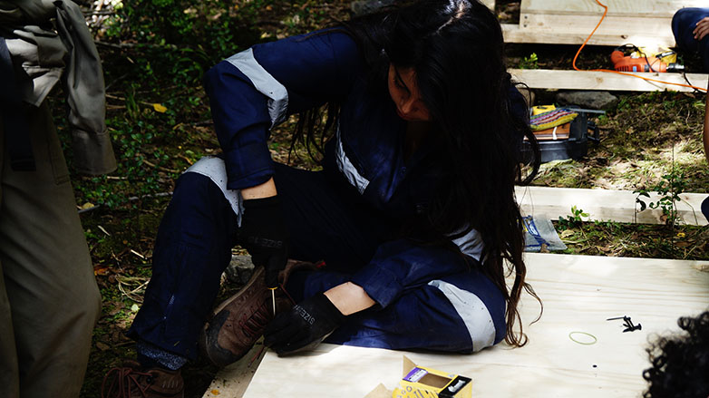

# Sábado 24 de Octubre

##Faenas

###Primera jornada

####Cubícula

- **Paneles**: Se continúa con lo comenzado el día anterior. Los paneles se finalizan poniendo las planchas que los cerrarían. 

- **Medición, corte y fijación de canes**: Ya con las vigas principales que sostendrán el suelo fiajdas entre sí y con las fundaciones es que se comienza a medir, cortar y fijar los canes que ampliarían la base de soporte de las vigas y las conectarían entre sí para poder distribuir y recibir de mejor forma los pesos que en ellos se carguen. Tal labor debió realizarse can por can, debido a que las vigas al ser madera bruta tenían distintas dimensiones y la extensión de los canes variaba, además esa extensión también iba variando a medida que se iba poniendo cada can, producto de la compresión de las mismas tablas.
- **Construcción de Cercha central**: Un grupo de estudiantes debieron trasladar 3 vigas de 6 m. x 3' x 9' desde la bodega de Don Oscar hasta la obra, éstas serían las tres vigas horizontales que le darían cuerpo a la cercha. Sus dimensiones definitivas serían de 120 cm. x 6 m. ubicándose una desde el 0, otra hasta el 120, y una entre ellas que estaba hasta los 90 cms. En vertical irían 7 trozos de 120 cm x 2' x 6', los cuales tendrían entre ellos 6 diagonales que cerrarían la cercha. Esta faena comenzó en la mañana con el traslado del material y la fijación de las 3 horizontales junto con las 2 verticales que cerrarían la cercha.

####Extensión americana

- **Montaje:** Durante esta jornada de la mañana se decidió que la manera de colgar las pájaras sería en forma de triángulo invertido. La primera fila sería de 3, la siguiente de 2 y la última de 1, por lo tanto, habría que hacer dos pirámides invertidas que al final se unieran en las puntas.
Comenzamos con la primera pirámide, la cual la presentamos en el suelo, atamos la primera fila junto con la segunda. Luego atamos los extremos de la primera fila para comenzar a elevarla como lo habíamos hecho el día anterior. Cuando esta ya estaba arriba atamos la última pájara. Luego de tenerlas todas, comenzamos a evaluar que soga había que alargar y cuales acortar en pos de evitar que las piezas se fueran a golpear con el viento. Luego repetimos el mismo proceso con las otras 6 pájaras.
Cuando ya los dos triángulos invertidos estaban listos, sólo faltaba unir el extremo de abajo con el otro triángulo. Luego de atarlos y tensarlos, comenzamos a evaluar hacia donde seguir tensando la estructura, ya que la escultura seguía un poco holgada. Cuando ya lo decidimos, los tensamos y dejamos el resto de la faena para la tarde.

###Segunda jornada

####Cubícula

- **Continuación fijación de canes**: se presentan un dimensionan los listones uno a uno para asegurar el calce.
- Fijación del suelo: Una vez puestos los canes se fue también fijando sobre éstos las planchas ya carbonileadas y selladas que darían lugar al suelo de la cubícula.
- **Acabado de paneles**: Lijado y acabado de los paneles, de tal forma de que quedaran listos para su instalación sobre el suelo de la cubícula.

- **Construcción de sercha central**: Durante la tarde se continuó con esta faena realizando los cortes de los trozos de 120 cm. Posteriormente se unieron a lo que había de cercha hasta ese instante sufriendo un gran retraso producto de la dureza del material el cual dificultaba el clavado de los mismos teniendo que sacar una seguidilla de veces los clavos doblados, cuestión que también tomaba por la misma dureza de las tablas. Finalmente se terminaría el día con el corte de la mitad de las diagonales, quedando el corte del resto y la fijación de éstas para la mañana del día siguiente en donde se finalizaría la cercha.
- **Construcción del suelo exterior**: Se comienza la faena de la construcción del suelo exterior que es, a la vez, la entrada a la obra. Para esto se sigue con la faena de recolección de piedras y la limpieza y emparejamiento del entorno proximo a la entrada de la obra. Luego se generan unos trazados que serían la base del camino que lleva a la entrada de la cubícula el cual estaría formado por las piedras recolectadas. 
 

####Extensión americana

- **Montaje:** Como ya la escultura estaba definida, sólo faltaba bajarla para cortar los trozos de soga sobrantes de los nudos para que se viera un acabado más fino y, posteriormente, atar las sogas que estaban afirmadas a los árboles a las ramas de más arriba, ya que podría pasar algún animal grande y pasar a llevar la soga. Para esto usamos una escalera para uno se subiera al árbol o pudiera mejorar el tensado. Luego de haber dejado los 6 puntos de tensión prolijos, la escultura se dio por finalizada.

## Restauro

- Desayuno: Té o café + Pan con huevo y salame + Leche en polvo o Cereal.
- Snack: Galletas toddy + Jugo.
- Almuerzo: Jugo + Sopa de Espárrago + Espirales con salsa boloñesa.
- Siesta hasta las 14:45.
- Snack: Galletas de avena + Jugo.
- Cena: Guiso de zapallo con papas fritas + Durazno en conserva con crema.
