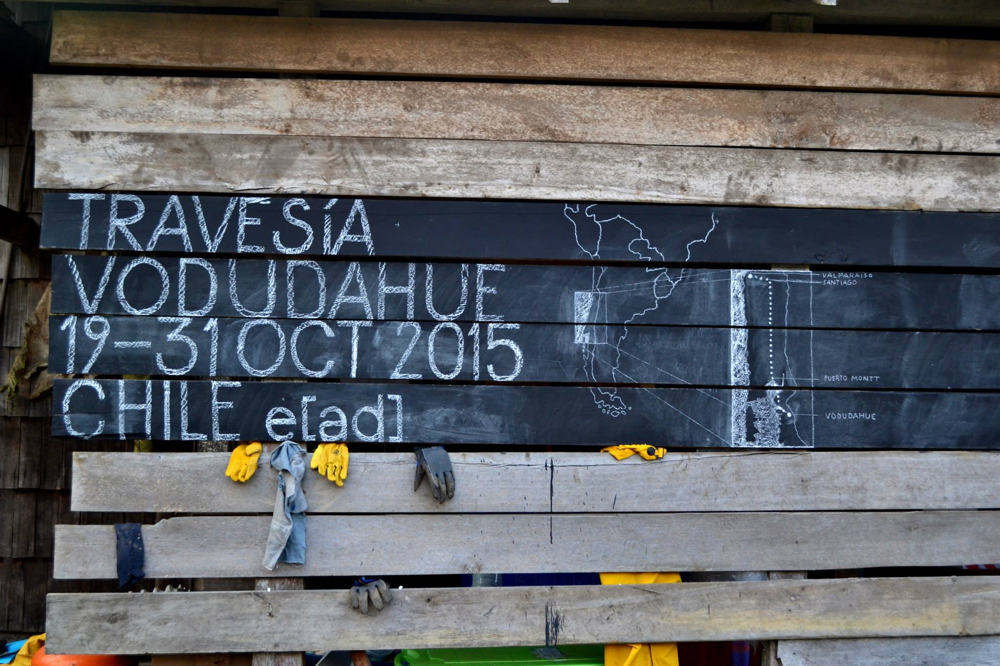
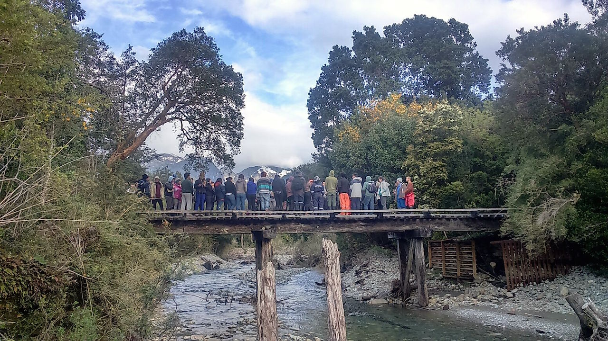

# Lunes 26 de Octubre

##Faenas

###Primera jornada

- **Cubícula:** Se terminaron de montar los muros interiores tanto del acceso como del descanso, mientras esto se construían y se montaban, otro grupo se encargó de pintar la obra por fuera un trazo con carbonileo. Junto a esto, otro grupo construía el suelo de la entrada con piedras.

- **Teselas:** e siguió con la faena de impresión del día anterior, ya que había que imprimir las 28 planchas por ambos lados, en donde cada cara posee cerca de 15 impresiones. Por ende se imprimieron cerca de 840 palabras. 

###Segunda jornada

- **Cubícula:** Se termina de pintar la obra por fuera.

- **Teselas:** Se siguió con la misma faena de la mañana, dándole termino esa misma tarde.

- **Pizarra:** El profesor y poeta Jaime Reyes le encargó a Remy Bender, estudiante de intercambio perteneciente al taller de Diseño Gráfico, que escribiera en la pizarra el nombre de la Travesía más su ubicación.

##Restauro

- Desayuno: Té o café + Pan con manjar + Leche en polvo + Avena.
- Snack: Frutos secos (Maní con pasas) + Jugo, té o café.
- Almuerzo: Puré con hamburguesa + Ensalada de repollo, palmito, huevo duro y atún + Fruta en conserva.
- Snack: No se entregó
- Cena: Pizza + Macedonia

##Ámbito

Acto sexto, Juego de las Cartas de la Phalène

Jaime Reyes, Rémy Bender @Puente del río

Rémy Bender

    Je suis le ténébreux, - le veuf, - l'inconsolé,
    Le prince d'Aquitaine à la tour abolie:
    Ma seule étoile est morte, - et mon luth constellé
    Porte le soleil noir de la Mélancolie.

Jaime Reyes

> Todo acto poético se inicia siempre con la recitación del poema “El Desdichado” de Gerard de Nerval. Así se iniciaban, se inician y espero que se inicien siempre las Phalènes desde el año 1952. El primer verso es el que marca el tono fundamental de la Phalène:

    Yo soy el Tenebroso, - el Viudo, - el Desconsolado,
    El Príncipe de Aquitania, el de la Torre abolida
    Muerta está mi única Estrella, - y mi constelado laúd
    Luce el Sol negro de la Melancolía.
    
    Amereida II bitácora: Notas Varios autores; Fragmento nota 2

Nos reunimos a las 18.00 en el puente para jugar. Rémy Bender, alumno de intercambio, lee un fragmento de en francés de el poema de Gerard de Nerval, “El Desdichado”. Jaime nos lee en español y nos explica el juego. Tiene 36 cartas, dice que hagamos parejas y elige tres jurados. Cada carta se lee de una manera específica por su contenido; una imagen que reúne varios conceptos y luego estos, son interpretados por cada pareja. Entonces, los jurados deciden, a su parecer, si lo que cada pareja dice de cada carta es aceptable o si puede tener otra lectura más acertada.

Jaime va pareja por pareja pidiendo que muestren su carta y digan fuerte la frase que representa cada imagen. Si el jurado está de acuerdo, Aucán va anotando en un cuaderno la frase, y si no está de acuerdo le pide a la pareja que saque otra carta y lo intente de nuevo. Así con las 36 cartas, 36 lecturas que construyeron ese momento y que Jaime reunió para hacer un poema en los próximos días.

 
