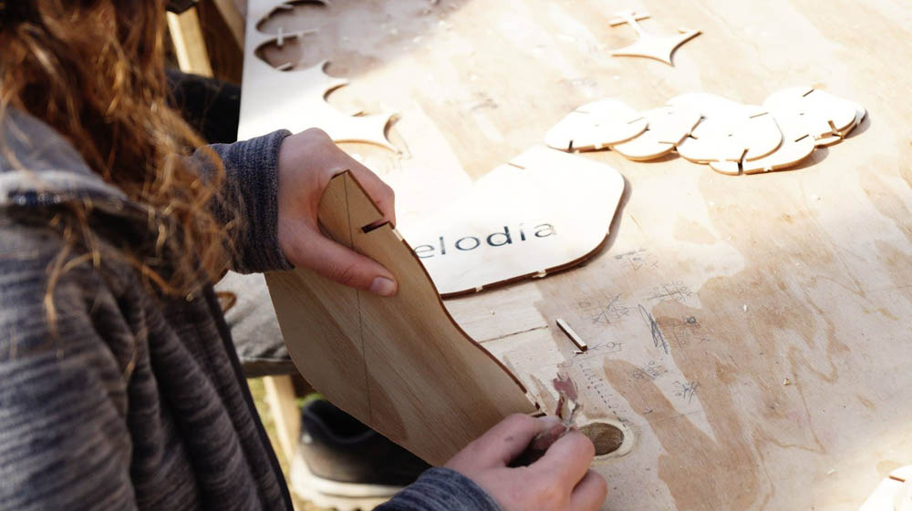
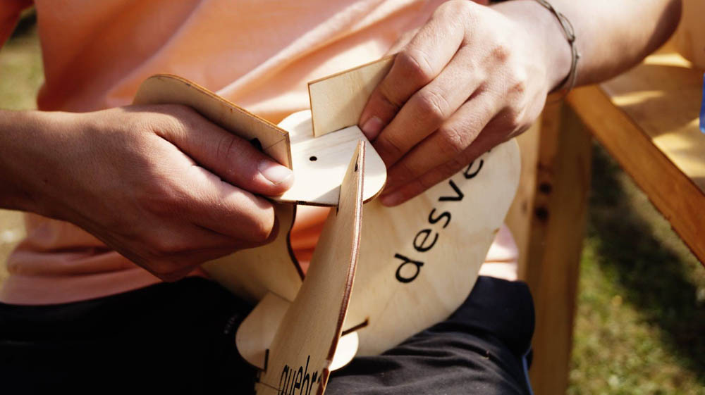
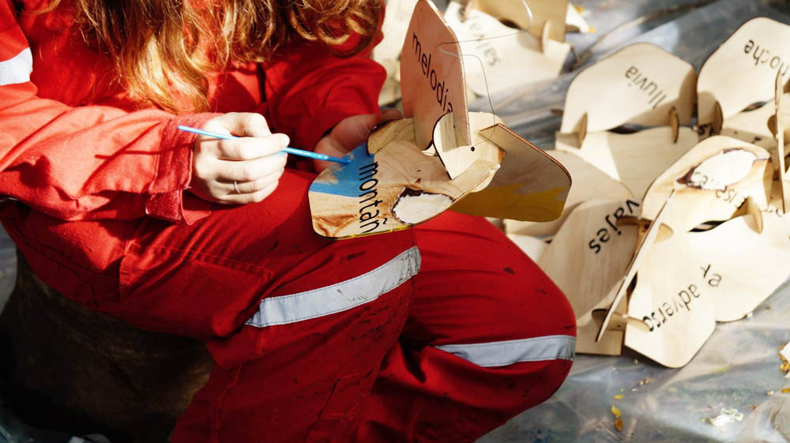
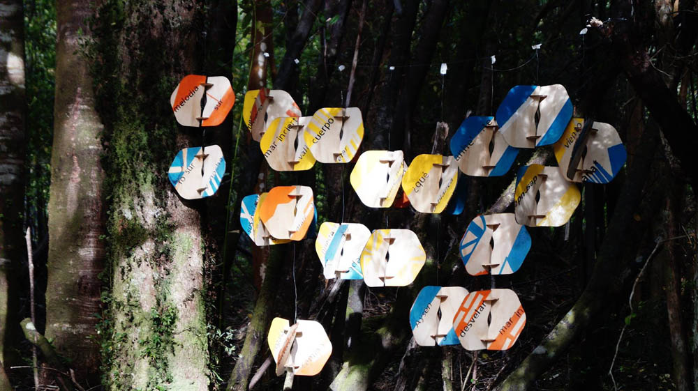

# Martes 27 de Octubre

## Faenas

### Primera jornada

**Cubícula**: A un grupo de 6 mujeres se les encargó la construcción de la escalera para entrar a la cubícula. Al mismo tiempo se comenzó a construir los muebles interiores, tanto los de restauro, acceso y descanso.
También se comenzó a pintar el trazo amarillo por la parte exterior.


**Teselas:** Este día nos dedicamos a sacar las teselas de la plancha de terciado, las cuales no estaban cortadas del todo ya que los cortes de la laser tenían un pequeño puente para que las piezas no se cayeran. Por esto, para sacar las piezas había que repasarlas con un cuchillo cartonero, luego de sacarlas, otro grupo se dedicaba a lijar los cantos para sacar las imperfecciones, luego otro grupo las armaba.

!

Para armarlas, las 2 piezas que componían el eje debían estar volteadas en relación a la otra, ya que así se conseguía la torsión de la tesela.




### Segunda jornada
**Cubícula:** Se siguó con la faenas de los muebles interiores.

**Teselas:** Durante la tarde, seguimos con la misma faena de la mañana. Pero paralelamente, las teselas que ya estaban listas en la mañana fueron llevadas al lugar de la escultura, ya que ahí estás serían pintadas de 3 colores: Amarillo rey, naranjo y azul con blanco. Luego de pintarlas se colgaban para dejar que se secaran y las dejamos allí cubiertas con un plástico ya que por la noche comenzó a llover.




```

## Restauro

- Desayuno: Té o café + Pan con mermelada + Leche en polvo + Avena.
- Snack: Galletón de avena + jugo individual + Naranja
- Almuerzo: .Ensalada de repollo y tomate + Lentejas + Manzana
- Snack: Frutos secos + Manzana + Leche individual
- Cena: Tortilla de atún con papas doradas + Naranjas con leche - condensada

## Ámbito

Acto séptimo, Cumpleaños Alfred Thiers

@Carpa-comedor titulante Ámber Oyarzún

Nos reunimos a cenar cerca de las 20.30, la carpa estaba ambientada para la celebración del cumpleaños número 33 de Alfred Thiers.
En la mesa de él, habían velas, flores pintadas con tinta china (amarilla, azul y roja) simulando un camino de mesa y un cartel dibujado con la cara del cumpleañero hecha por tres alumnos de primer año (Marcelo Delgado, Felipe Arancibia y Paulina Diez).

* Se preparó una torta de cuchuflí dividida por secciones para facilitar la distribución por mesa (3 cuchuflí por persona)
* Se colocaron globos en los pilares de madera de la carpa

Al finalizar la cena se llevó la torta de cuchuflí hacia el lugar donde se encontraba Alfred, mientras se hacía esto, todos cantaban el “cumpleaños feliz”. Las velas de la torta se apagaron y posterior a esto se hizo la entrega de los cuchuflí por mesa.


