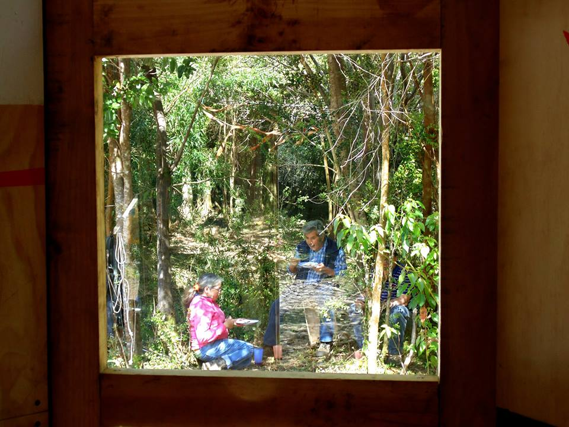
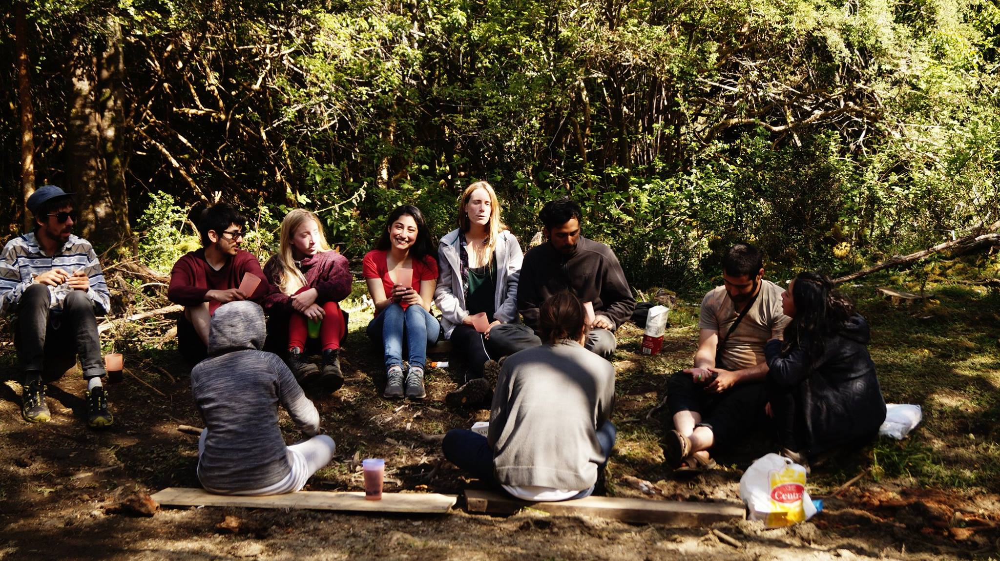

# Sábado 31 de Octubre

## Faenas

### Primera jornada

El desayuno nuevamente nos reúne a todos, para luego dar comienzo a las faenas de cierre que consisten en terminar los últimos detalles de la obra tales como; instalar los vidrios, limpiar el entorno de la obra, los baños y duchas que nos facilitaron a lo largo de la estadía en Vodudahue. Estas fueron concluidas alrededor del mediodía, dando paso al acto de cierre de la obra en el sector de las pájaras, reuniendo a los profesores, alumnos e invitados, tales como, los Sargentos de Vodudahue, Don Oscar y familia. Al finalizar la lectura de Jaime Reyes y las palabras de agradecimiento del grupo de profesores, se dio inicio a la celebración de la finalización constructiva de la obra y la apertura de la Cubícula Cardinal, realizando un banquete alrededor de la Cubícula, preparado por los encargados correspondientes al grupo de restauró.

Fue tras este momento de celebración que la mayoría de los alumnos no tuvo más tareas de travesía, salvo los alumnos de restauró quienes debieron cerrar el banquete y comenzar a preparar la cena.

### Segunda jornada

El grupo de travesía se vuelve a reunir en la cena, tras esta concluir se hace entrega de dulces como símbolo de celebración de la Víspera de Todos los Santos, fiesta comúnmente llamada “Halloween”.

## Restauro
- Desayuno: Pan con mermelada, chocapic o avena, con yogurt, leche en polvo, té o café
- Snack: Alfajor con una caja de leche para cada uno.
- Almuerzo:  Salmón, arroz, papas, verduras salteadas, ensalada, pan con ajo, salsas y pie de limón, acompañando todo esto con vino tinto y ponche de vino blanco con macedonia.
- Snack: No se entregó.
- Cena: Salmón con arroz y ensalada.

## Ámbito

Acto noveno, Agradecimientos

Jaime Reyes, Alfred Thiers @Bosque-Pájaras

**“El objetivo de la travesía ha sido logrado, pero no significa un final, sino que otro comienzo.”**

Nos reunimos bajo las Pájaras, formando un círculo grande con todos los que participaron en la travesía, los sargentos de Vodudahue, Don Oscar y su familia. El poeta leyó un fragmento de Amereida II y luego Alfred dió unas palabras de agradecimiento al lugar y a todos los que hicieron posible, sin mayores complicaciones, esta experiencia, esta travesía.

Jaime Reyes:
    
    “¿Centro del tiempo? ¿Amereida? ¿Cruz sobre la
    Amereida? No tan sólo para una vista cartográ-
    fica y casi cosmonáutica; sino cruz reproducida en
    todo puesto, en todo lugar: llevada a todo lugar
    la estrella cardinal la estrella de los cua-
    tro ángulos del tiempo en la jornada rectangular
    por nuestra trapa de nueve frentes nuestra
    muda espera políglota nuestra girante rosa de
    los vientos nuestra veleta que inviste las ciu-
    dades en todo sentido trazando signos sobre las
    casas apropiándonos hasta el acabóse el papel
    de ángeles tomando a nuestro cargo “realizar” las
    promesas figuradas desde siempre encajando so-
    bre el terreno el macrocosmos y el microcosmos
    ayuntando aquí la piedra cruda con la prescrip-
    ción del allá atornillando las mitades desigua-
    les la una a la otra para que haya un signo…”
    
    Página 4, Amereida II
