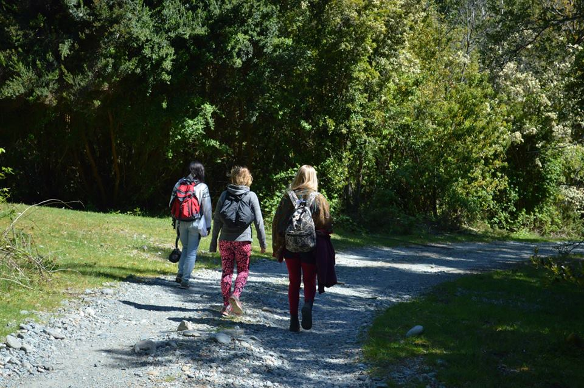
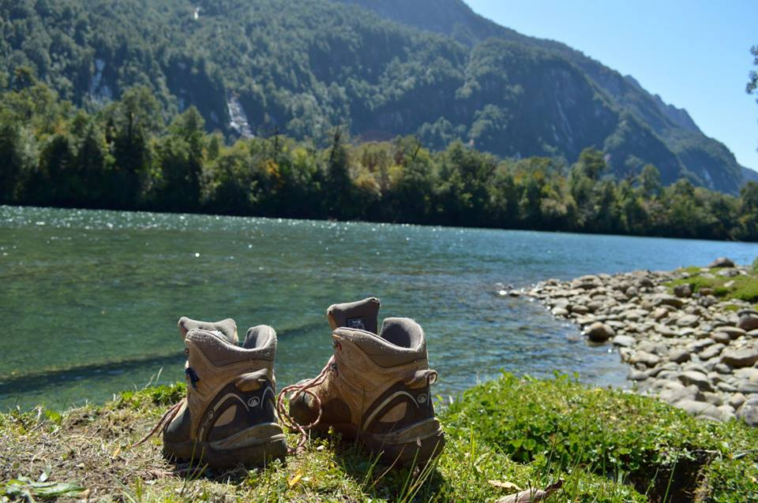

# Domingo 1 de Noviembre

##Faenas
 
### Primera jornada 

Después de un día de celebración y el aviso de que el viaje de regreso a casa sería postergado, debido a que un bus no alcanza a subirse al transfer, provocando que estuviéramos en Vodudahue un día más, lo cual hizo que el día fuera totalmente distinto a los anteriores, donde los alimentos fueron dejados simplemente sobre el comedor. 

Ciertas personas prosiguieron a realizar las tareas de desmonte del campamento, comenzando por el desarme de la carpa comedor y la carpa ubicada en la obra, luego se ordenó la cocina, donde se dejaron sólo las cosas necesarias para el almuerzo y la cena para los días restantes, repartiendo lo restante dentro del campamento. Entonces cuando el almuerzo fue servido, se dio inicio a la tarde libre, para descansar o recorrer el luegar.

### Segunda jornada

La tarde comenzó con el viaje a las cinco de la tarde a Leptepu donde se cargaron los pañoles de obra y los de cocina, de igual forma ambas carpas.

A la llegada de los alumnos que cargaron los buses se sirvió la comida y se dio por cerrada la cocina, para ir más tarde a la Cubícula Cardinal a presenciar el último acto correspondiente a la travesía.

## Restauro

- Desayuno: Frac  y leche de chocolate.
- Snack: No se entrega 
- Almuerzo:  Lentejas con salmón y un huevo duro + ensalada de tomate con cebolla
- Snack: No se entregó.
- Cena: Maruchan

## Ámbito

Acto décimo, ¿Cuál es el alba perpetua de tu origen?, Jaime Reyes alrededor de la Cubícula Cardinal.

Nos reunimos tarde en la obra ya terminada. Estuvimos esperando a que llegaran todos al rededor de la fogata que estaba a la salida del habitáculo. Cuando llegaron todos, Jaime nos pidió que rodeáramos la cubícula  y que aguardáramos silencio. La cubícula, iluminada desde su interior con velas se veía muy acogedora...

Íbamos entrando uno por uno a la cubícula y adentro iba a estar el poeta y dos regalos (dos papeles plisados uno con color y otro en blanco) además el poeta nos iba a decir una parte de un poema al oído y teníamos que memorizarlo. Al salir, debíamos esperar en la fogata a los demás.

Cuando ya todos habíamos pasado por ahí, Jaime nos pidió que todos dijéramos en voz alta lo que nos había dicho al oído: “¿Cuál es el alba perpetua de tu origen?”

Luego, el alumno Lucas Vildósola, relató el mito de la Ciudad de los Césares, con mucha calma y suspenso. Cuando terminó, nos pidieron que imaginásemos que el papel que retiramos en la cubícula (el que estaba en blanco) era algo que anhelábamos dejar atrás. Luego de pensar en eso, cada uno tenía que tirar su anhelo en la fogata. Nos quedamos en silencio rodeando la fogata por varios minutos... había una sensación de no querer irse de este lugar.

Herbert

> Debemos caer en la cuenta que en esta travesía todo se ha vuelto materia, todo es diseñable. 
Somos capaces de diseñar nuestro entorno en todos los aspectos. 
Se trata de caer en la cuenta de que nuestra cotidianeidad es diseñable, la verdad es que 
el mundo es maleable, modificable, diseñable.
Algunas personas piensan que uno está determinado por su entorno, por su contexto, por su 
raza, por sus padres, por su riquezas, etc. 
Pero la realidad es que el presente está abierto y es apertura es la forma de romper esa 
determinación. Por eso escuchamos a la poesía, porque nos trae el presente abierto. 
Mundo maleable y presente abierto. Entonces ¿cuál es el alba perpetua de tu origen?

Se iluminó el refugio mediante velas repartidas en su interior en el cual se dejó a disposición 1 bandeja hecha de papel que contenía 70 papeles plisados en blanco y además se dejaron otro tipo de papeles plisados con una sección pintada azul o roja repartidos por el interior del refugio. El camino hacia el refugio se adorno con palos clavados al piso separados a 1 metro entre sí, unidos por una pita en la cual se colgaron flores de papel reutilizadas de un acto anterior.