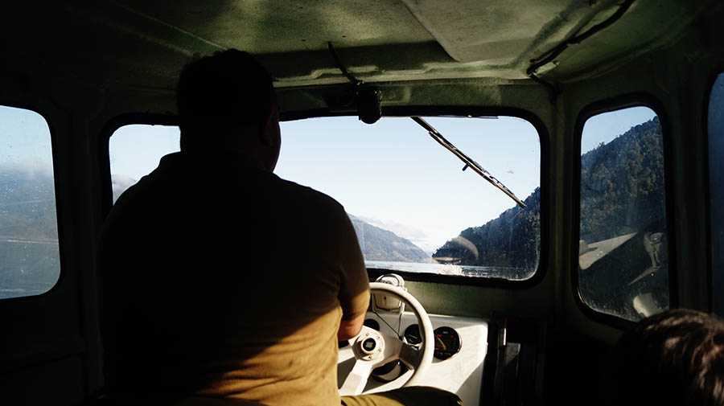

# Lunes 2 de Noviembre

## Faenas

### Primera jornada 

El día comienza con el ajetreo que genera desarmar el campamento, cada grupo de carpa se preocupa de desarmar la suya y guardarla, el plan es terminar esta faena a las ocho y media de la mañana para que de esta forma las primeras cosas puedan ser llevadas en la lancha desde el muelle de CMT  y no desde uno más lejano por problemas de marea. El primer grupo sale de Vodudahue a las diez para las nueve de la mañana.

De esa forma se marca el inicio  de carga de los buses de las cosas que faltaban el grupo completo se reúne por completo y espera la llegada del ferry a las tres y media de la tarde sirviendo el almuerzo durante la larga espera. 
El ferry arriba a Leptepu con destino a Hornopirén marcando como nos alejamos del silencio en el que nos encontrábamos 

### Segunda jornada 

El viaje de regreso comienza a bordo del ferry camino a Hornopiren, donde se llega las seis y media de la tarde, dando comienzo ahora al viaje por tierra hasta Puelche y posteriormente hasta Caleta la Arena.

El dia se da por concluido con la parada y cena que se hace en Puerto Varas.

## Restauro 
 
- Desayuno: Chocapic con leche.
- Snack: Galletas toddy y jugo.
- Almuerzo : Pan con atun queso y mayonesa.
- Cena: Libre, pronto copec.  
 